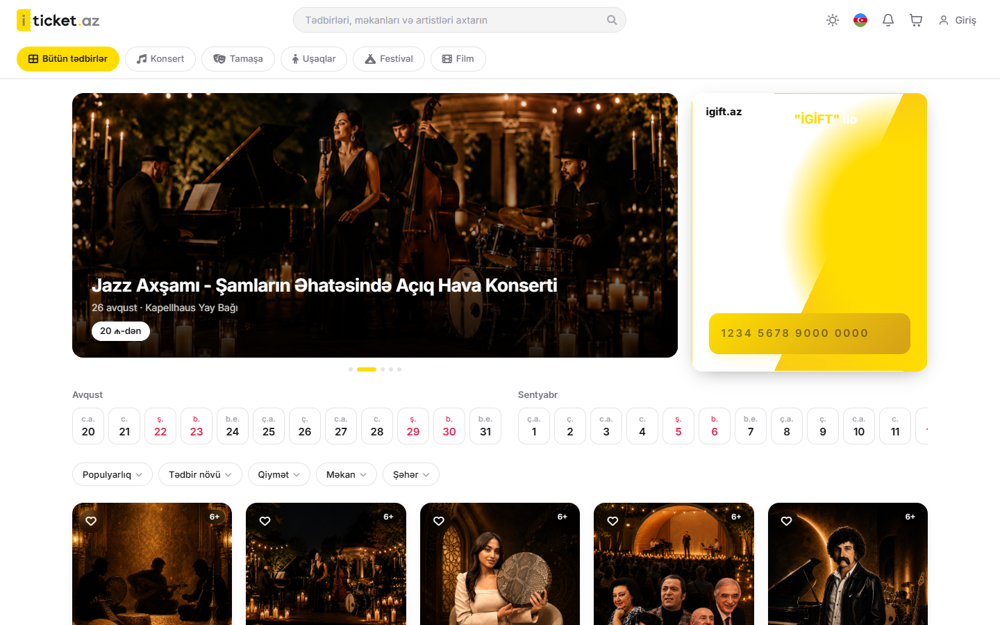
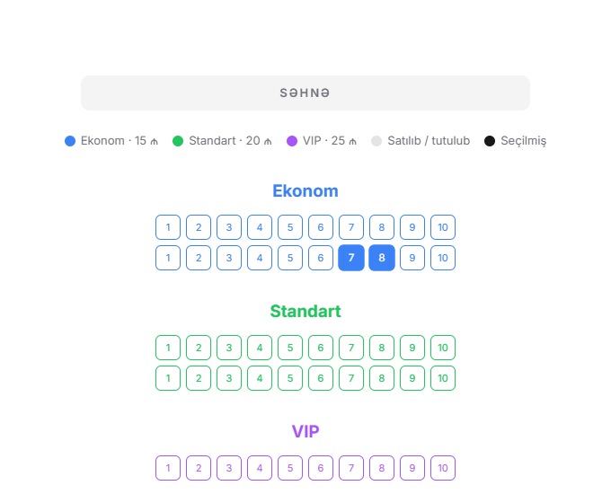
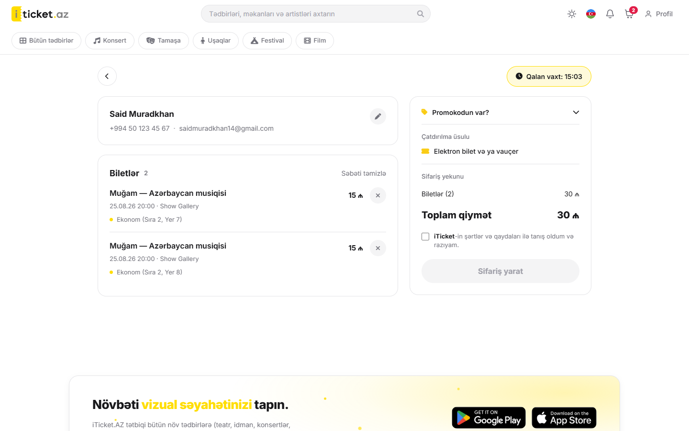
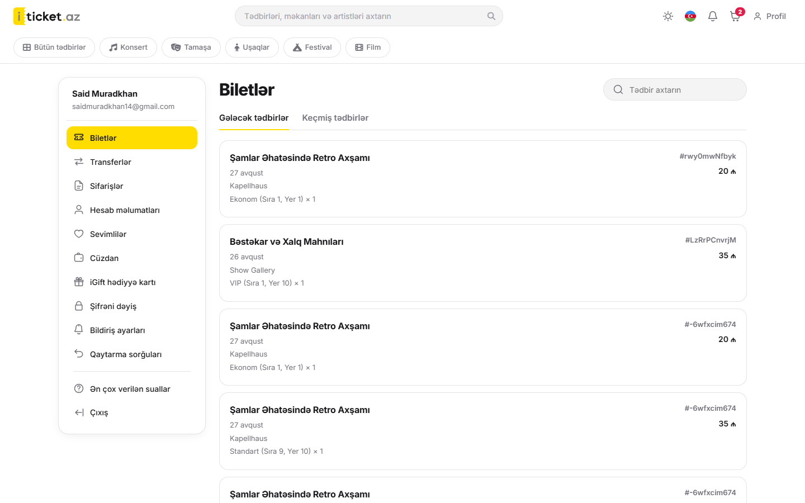

# iTicket Clone

An event ticketing platform modelled on [iTicket.az](https://iticket.az), built as a solo learning project. Users can browse and search events, pick seats on an interactive seat map, and pay by card through the real **Payriff** payment API.

> Educational project. Not affiliated with iTicket.az.



## Features

- **Events:** category pages, search, and filters (category, date range, price range, venue) with sorting
- **Interactive seat map:** seat selection with tooltips; seats are held on the server while the user checks out
- **Cart and checkout:** countdown timer for the reservation, order summary, choice of payment method
- **Card payments via Payriff:** a Node.js/Express service creates the payment and checks its status with Payriff (see [Payment flow](#payment-flow))
- **Auth:** email sign-up and login, plus Google sign-in (OAuth); profile pages are protected routes
- **User profile:** tickets, orders, ticket transfers, wallet and top-ups, gift cards, favorites, refund requests, notification settings, password change
- **Notifications:** in-app notification bell
- **Multi-language UI (AZ/EN)** and **dark/light theme**

| Seat map | Cart | Profile |
|---|---|---|
|  |  |  |

## Tech stack

| Layer | Tools |
|---|---|
| Frontend | React, Vite, React Router, Context API, Axios |
| Backend | Node.js, Express (payment and seat-hold API) |
| Data | json-server (mock REST API) |
| Integrations | Payriff API v3, Google OAuth (`@react-oauth/google`) |

State is split into contexts: `AuthContext`, `CartContext`, `FavoritesContext`, `LanguageContext`, `NotificationContext` and `ThemeContext`.

## Getting started

**Requirements:** Node.js 20+ and a Payriff account (only needed for card payments).

```bash
git clone https://github.com/saidmuradkhan/Iticket.git
cd Iticket
npm install
cp .env.example .env
```

Fill in `.env`:

| Variable | Description |
|---|---|
| `PAYRIFF_SECRET_KEY` | Secret key from the Payriff dashboard (**Applications**) |
| `PAYMENT_PORT` | Port for the payment API (default `3002`) |
| `JSON_SERVER_URL` | URL of json-server (default `http://localhost:3001`) |
| `APP_URL` | Frontend URL that Payriff redirects back to |
| `VITE_PAYMENT_API` | Payment API URL used by the frontend |
| `VITE_GOOGLE_CLIENT_ID` | Google OAuth client ID |

Run the three processes in separate terminals:

```bash
npm run server    # json-server  -> http://localhost:3001
npm run payment   # payment API  -> http://localhost:3002
npm run dev       # frontend     -> http://localhost:5173
```

## Payment flow

1. From the **Cart**, an order is created in json-server with the status `pending_payment`.
2. On the **Order** page the user selects card payment, and the frontend calls `POST /api/payment/create`.
3. The server opens an order in Payriff, returns the `paymentUrl` and saves the `payriffOrderId` on the order.
4. The user enters card details on Payriff's payment page.
5. Payriff redirects back to `/payment/result?orderId=...`.
6. The **PaymentResult** page calls `GET /api/payment/verify/:orderId`. The server asks the **Payriff API** for the status (it does not trust query parameters from the browser) and updates the order.

The secret key is read only by `backend/`. It has no `VITE_` prefix, so it never ends up in the frontend bundle.

### API endpoints (`backend/index.js`)

| Method | Path | Purpose |
|---|---|---|
| `GET` | `/api/payment/health` | Server and secret-key status |
| `POST` | `/api/payment/create` | Opens a Payriff payment and returns `paymentUrl` |
| `GET` | `/api/payment/verify/:orderId` | Checks the status with Payriff and updates the order |
| `POST` | `/api/seats/hold` | Holds a seat for the current user |
| `POST` | `/api/seats/release` | Releases a held seat |

## Project structure

```
backend/          Express payment and seat API, json-server data (db.json)
src/
  api/            Axios clients (events, orders, seats, Payriff)
  components/     Header, SeatMap, EventFilters, TicketSelector, Auth, ...
  context/        Auth, Cart, Favorites, Language, Notification, Theme
  hooks/          useEvents, useCountdown, useLocalStorage, useLanguage
  i18n/           AZ/EN translations
  layouts/        MainLayout, ProfileLayout
  pages/          Home, EventList, EventDetail, Cart, Order, PaymentResult
  Profile/        Profile sub-pages (tickets, wallet, refunds, ...)
```

## Author

**Said Muradkhan**: [GitHub](https://github.com/saidmuradkhan) · [LinkedIn](https://www.linkedin.com/in/said-muradkhan-0103a2350/)
